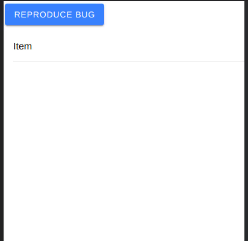

# Ionic Bug with disabled ion-item-sliding and close()

When calling the **close()** method on a **disabled** ion-item-sliding, the user can still interact and open options.

## Install and run

1. Clone this repo
1. Run `cd ionic_bug_report`
1. Run `npm start`
1. In your browser click the **Reproduce Bug** button and the try to swipe **Item** from the right to the left

## Demo

